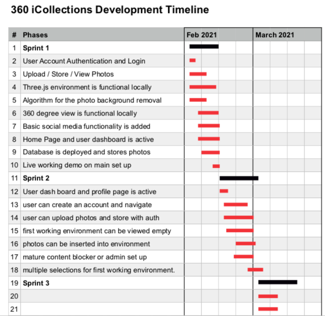

Starlane Project Inception
=====================================

# Team Project Inception: Vision statement

**For** anyone **who** wants a easy and fun way to share with others their collections or collectables, **the** 360 iCollectables Creator **can** upload and render photos of their collectable items **that** will be displayed in 2D, 360 degree, or possibly 360 full virtual environment. The system will store the users uploaded photos of items, allow user selection of the available environments, and give the ability to place their items into the environment at specific locations, and then allow others to view their environments filled with their collectable items. **Unlike** albums of photos **our users** will be able to show off large collections of items in a single format that can easily show the scale of the collection, while maintaining the ability to inspect individual items closely. 

# List of Needs and Features
1. **Need:** We need to design the database that needs to store the user data, as well as the photos, environments, and other associated data.
    - **Feature:** Show Users the selection of pre-made environments ready to be filled with photos of collectables
    - **Feature:** The Photos will be uploaded by the user and rendered into the appropriate format depending on the environment.
    - **Feature:** Provide Users the ability to store there photos to be rendered into different environments.
        1. **E:** As a ...
            - **U:** As a ...
                1. Description ...
                2. Unsuccessful search, ...
                3. Successful ...
                4. Description of Datat
                5. Description of progress
                6. AJAX or traditional page load?
                7. Write tasks...
                8. Acceptance criteria [later]
            - **U:** As a ..

2. **Need:** We need user dashboard that can show exisiting collections the user has made, and links to create a new collection, edit their exisiting ones, or browser their friends and public collections 
    - **Feature:** Show Users can select various backgrounds to use to display their items.
    - **Feature:** Better way for users to view their creations, raw photo uploads, and decide upon which activity they want to do.
    - **Feature:** Provide ..
        1. **E:** As a ...
            - **U:** As a ...
            - **U:** As a ..

3. **Need:** We need to Create the 2D collectables environment viewer, creator, and template, and allow the templates to be filled with either unaltered photos, or background removed photos.
    - **Feature:** Show 2D environments that they can select like a wall with frames, or card table,
    - **Feature:** Better way to view a whole collection of items in one view, being able to scroll around and zoom just like in the miro environment.
    - **Feature:** Raw photos or background removed photos can go into predesigned slots.
        1. **E:** As a ...
            - **U:** As a ...
            - **U:** As a ..

4. **Need:** We need to Create the 360 collectables environment viewer, creator, and templates, and allow the templates to be filled with either unaltered photos, background removed photos, and 3D rendered photos.
    - **Feature:** Show The 360 environment templates that are available for the user to choose from.
    - **Feature:** A User can place rendered photos into the 360 environment in pre-designed slots.
    - **Feature:** 360 degree viewer is in the browser so that the finished collectables can be viewed.
    - **Feature:** Use on mobile photo to physically view the 360 environments by moving the phone around.
        1. **E:** As a ...
            - **U:** As a ...
            - **U:** As a ..

5. **Need:** We need to create an augmented reality / virtual collectables environment viewer, creator, and templates, and allow the templates to be filled with either unaltered photos, background removed photos, or 3D rendered photos.
    - **Feature:** Show the rendered environments that the user can select to fill with their collectables.
    - **Feature:** photos need to be rendered in 3D to be placed with the virutal environement.
    - **Feature:** Provide users the ability to navigate the virtual environment to view the items that it contains.
        1. **E:** As a ...
            - **U:** As a ...
            - **U:** As a ..

6. **Need:** We need to set levels of visibility for our users so that they can choose who they want to share their collections environments with.
    - **Feature:** Allowing the users to either have a private collections, unlisted collection, or public collection.
    - **Feature:** Better way ...
    - **Feature:** Provide ..
        1. **E:** As a ...
            - **U:** As a ...
            - **U:** As a ..

# Identify Non-Functional Requirements
1. 
2.
3.

# Initial Architecture Envisioning
    Desktop computer: PC or Mac
        Internet access
        Internet browser
        
    Cloud: Azure 
        web server
            .NET Core
            C#
        SQL server
        SQL database
            DBMS: Microsoft SQL Server
    
    API: photo background remover

# Agile Data Modeling
    Diagrams, SQL modeling (dbdiagram.io), UML diagrams, UI wireframes, page flows, ...

[Flow Chart / Mindmap ](https://miro.com/app/board/o9J_lXPB2mE=/) 

<!--  -->

[dbdiagram initial data model ](https://dbdiagram.io/d/6019335180d742080a38d1e9) 

## DB Designing Brainstorming txt file.
[DB Designing Work Link to seperate txt file.](DB_design.txt) 

# Timeline and Release Plan

# Identify Functional Requirements (In User Story Format)

E: Epic  
U: User Story  
T: Task  
1. 
2. 
3. [E] 
    1. [U]
        a. [T]
        b. [T]
    2. [U]
        a. [T]

# Identification of Risks

<a href="README.md">Return to Milestone 4 README file</a>
